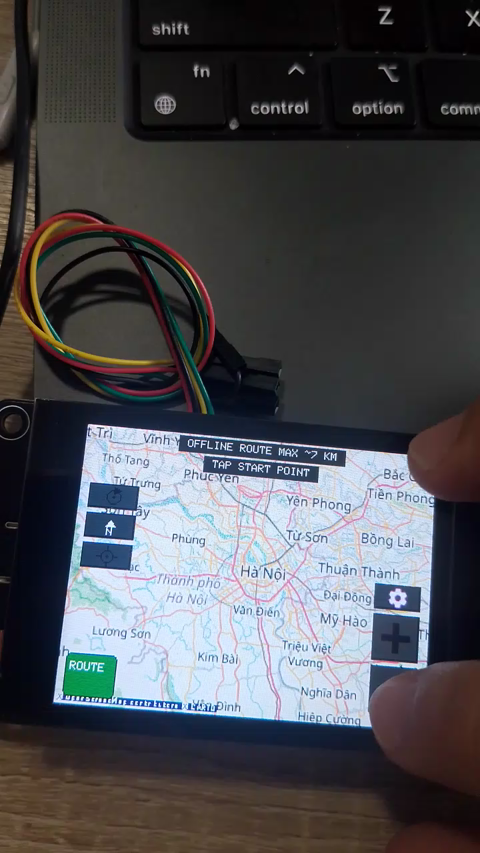
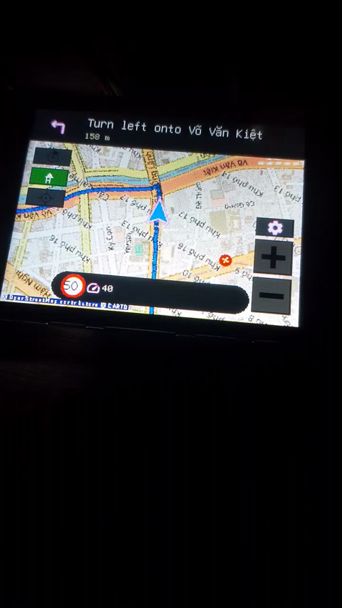

# ESP32-S3 Car Navigation Display

ESP32-S3 offline car navigation display. Renders OSM map tiles (from SD, WiFi
fallback), follows the car via BLE from your phone (route + position + next-turn
nav), and can route itself offline across the whole of Vietnam using a compact
road graph loaded from SD.

Board: **2.8" IPS ESP32-S3 + ILI9341** (ES3C28P / ES3N28P).

## Demos

**Offline A\* routing on device**
<video src="videos/ble-navigation.mp4" controls muted width="480" poster="videos/ble-navigation-poster.png"></video>

[](videos/ble-navigation.mp4)

- YouTube: https://youtube.com/shorts/bZp_f6lPf84
**BLE navigation (drive simulation)**

<video src="videos/astar-routing.mp4" controls muted width="480" poster="videos/astar-routing-poster.png"></video>

[](videos/astar-routing.mp4)

- YouTube: https://youtube.com/shorts/pddq8PctX3E

## Hardware

- ESP32-S3, 240 MHz, **16 MB flash, 8 MB octal PSRAM**
- ILI9341 320×240 landscape over SPI2 @ **80 MHz** (MOSI=11, MISO=13, CLK=12,
  CS=10, DC=46, RST=18, BL=45); backlight is PWM-dimmable (settings slider,
  default 50%)
- FT6336 capacitive touch on I2C (SDA=16, SCL=15) — tap / drag pan,
  **long-press 5 s = deep sleep**, touch wakes it
- Native USB-Serial/JTAG (Type-C)
- MicroSD: offline map tiles + offline routing graph
- Powered over USB (e.g. car 12 V→USB adapter)

## Architecture

```
                    ┌─────────────── ESP32-S3 ───────────────┐
 Phone / web sim    │                                       │
 (navbridge /       │  ble_nav ◄── BLE GATT ── route/pos/   │  SD card
  web_ble_nav) ─BLE─►            nav/eta/clock/weather/cam  │   z11–15 tiles
                    │        │                              │   routing.rng
 GPS (U-Blox) ─UART─►  gps_ublox ──BLE broadcast (optional) │
                    │        │                              │
                    │  map_view: 448² PSRAM "world",        │
                    │    heading-up rotation, smooth follow │
                    │  ui_controls: HUD (banner, speed,     │
                    │    time/ETA, weather, camera alert)   │
                    │  routing: offline A* over RNG2 window │
                    └──────────────────┬───────────────────┘
                                       ▼
                               ILI9341 320×240 @ 80 MHz
```

- **Map**: slippy tiles z11–15 from SD (24-slot × 128 KB PSRAM cache, prefetch
  ahead of the car); z16 + out-of-area tiles fall back to WiFi when connected.
- **Navigation**: the phone streams route windows (≤256 pts), position,
  next-turn + next-next maneuver, clock, ETA, weather and speed-camera alerts
  over BLE. The board interpolates/extrapolates fixes so the map scrolls
  continuously and turns heading-up.
- **Offline routing**: `routing.rng` (whole-Vietnam RNG2 spatial index) is
  window-loaded around the current view on ROUTE press; tap start → tap stop →
  A* path in ~270 ms for a ~10 km route. Gated on the **OFFLINE RTE** setting.
- **Render**: ~28 fps cap (35 ms frame), ~11 ms rotate + ~19 ms DMA push.

## Build & flash (ESP-IDF 5.5.5)

```bash
# one-time: source the IDF environment (paths on this machine)
export IDF_TOOLS_PATH=/Users/tungdl/Documents/Eink/.espressif
export IDF_PYTHON_ENV_PATH=/Users/tungdl/Documents/Eink/.venv
source /Users/tungdl/Documents/Eink/esp-idf/export.sh

cd ESP32_OSM_NAV/build && ninja all
ESPTOOL_PORT=/dev/cu.usbmodem101 ninja flash
```

Notes: kill any serial logger (`pkill -f "Python -u -"`) before flashing — a
stale logger holds the USB port and the flash fails. The board's USB-Serial/JTAG
is flaky; retry the flash if it fails transiently. `car_nav.bin` is ~1.8 MB
(88% of the app partition free).

## SD card contents

```
/sdcard/tiles/z11..z15/  <z>/<x>/<y>.png     offline map tiles
/sdcard/routing.rng                            whole-Vietnam routing graph (120 MB RNG2)
/sdcard/config.txt                             offline_route=0/1 (UI setting)
```

## BLE protocol (phone → board)

GATT: service `5a7e1000-…`, characteristic `5a7e1001-…` (WRITE/NOTIFY).
Binary frames preferred, XML accepted as fallback:

```
frame: [0xAA 0x55] type len_lo len_hi payload
 0x01 route : zoom(u8) count(u16) lat0/lon0(i32×1e7) + deltas(i16×1e5)
 0x02 pos   : lat(i32×1e7) lon(i32×1e7) spd(u8) hdg(u16) sl(u8)
 0x03 nav   : dist(u16) modId(u8) slen(u8) street
 0x04 eta   : h(u8) m(u8) alen(u8) arrive
 0x05 clock : h(u8) m(u8)
 0x08 nav2  : next-next maneuver (same as 0x03)
 0x09 camera: dist(u16) type(u8)   (dist=0 clears)
 0x07 weather: tempC(s8) hum(u8) code(u8) slen(u8) text
```

Web simulator + packet docs: see [`web_ble_nav/`](web_ble_nav/README.md).

## Power consumption

This is a **continuous navigation display** — it redraws the map ~28×/s while
driving, so it draws current the whole trip. The numbers below are **estimates
from datasheet/typical values** — verify with a USB power meter on your own
board. All figures at 5 V (board input).

### Active (driving, backlight at default 50%)

| Component | Current | Notes |
|-----------|--------:|-------|
| ESP32-S3 @ 240 MHz (CPU + PSRAM + SPI + BLE RX) | ~140 mA | dual-core, octal PSRAM, radio connected (RX-dominant) |
| ILI9341 panel (refresh) | ~10 mA | VCI/VDDI draw; SLEEP IN drops it to ~µA |
| Backlight @ 50% (128/255) | ~30 mA | **dominant draw** — full ≈ 60–80 mA, 0 = off |
| SD reads (avg, tiles cached in PSRAM) | ~15 mA | bursty on new-tile loads |
| 5 V→3.3 V LDO + misc | ~5 mA | regulator + LED + quiescent |
| **Total** | **~200 mA** | **≈ 1.0 W** |

A car USB port (≥0.5 A) runs it at ~40 % of its rating — no concern while
driving.

### Deep sleep (long-press 5 s, or auto)

| Component | Current |
|-----------|--------:|
| ESP32-S3 deep sleep (RTC + touch wake on GPIO17) | ~10 µA |
| ILI9341 SLEEP IN + backlight off | ~100 µA |
| LDO quiescent + leakage | ~10 µA |
| **Total** | **~0.12 mA** |

### Battery duty-cycle example (corrected)

Say you drive **2 h/day** and sleep the other **22 h**:

| Mode | Current | Time | Energy |
|------|--------:|-----:|-------:|
| Active | 200 mA | 2 h | 400 mAh |
| Deep sleep | 0.12 mA | 22 h | 2.6 mAh |
| **Daily total** | | | **≈ 403 mAh** |

- **5000 mAh USB power bank** (3.7 V): ~5000/403 ≈ **12 days** of 2 h/day driving.
- **2×AA 2500 mAh NiMH** (boosted to 5 V): ~2500/403 ≈ **6 days** of 2 h/day,
  minus boost/LDO losses.

> The old README's "150 days on 2×AA" came from a **watch-style** design that
> slept 30 s between brief WiFi fetches and lit the display only ~30 min/day
> (and its JPEG row was also 100× off). That design no longer exists — this
> board drives a live map continuously, so the number that matters is the
> **~200 mA active draw**, i.e. power it from the car and treat the display as
> the main cost. To stretch a battery: lower the brightness slider (backlight is
> >50 % of draw) and use deep-sleep standby when parked.

## Features (from `src/`)

- ✅ Offline SD tiles z11–15 with PSRAM cache + prefetch; WiFi fallback
- ✅ BLE navigation: route (256 pts), pos, nav ×2, eta, clock, weather, camera
- ✅ Heading-up rotation with eased turn swing + smooth position follow
- ✅ Offline routing across whole VN (RNG2 windowed A*, OFFLINE RTE setting)
- ✅ FT6336 touch gestures; long-press deep sleep; brightness slider
- ✅ GPS (U-Blox NMEA) broadcast over BLE
- ✅ Perf logging (avg ms/fps per frame stage on serial)
